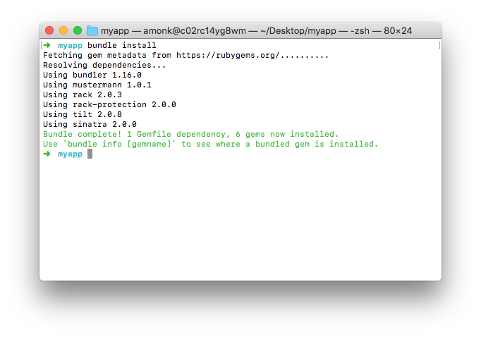

# Heroku Sample App Change Again

Learn to write & deploy a straightforward Heroku app built in the Ruby programming language.

## What we're going to make

We're going to make a simple Heroku app that simply says "Hello!" to us. We're going to learn about;

* Writing a simple Ruby app and running it on our own machine
* Creating a Heroku app
* Deploying our code to Heroku

---

## Before we begin...

Before we set off, there's a few prequisites. We're going to need;

* A text editor to write our app
* Ruby installed and configured correctly
* The Heroku app to create and deploy our app
* A Mac computer running latest macOS

### Text editor

Let's go ahead and download Atom, a popular 
and free text editor made by Github.

[Download Atom for macOS](https://atom.io/download/mac)

### Ruby

If you've got Ruby installed already then you can skip this section.

Let's start by opening the Terminal. Hit <kbd>CMD</kbd>+<kbd>Space</kbd>, then search for and open Terminal.

You'll be presented with the following gloriously minimalist screen.


Now paste the following into your terminal. This code will setup a system called [Homebrew](https://brew.sh/), which will make it easy to install Ruby.

```bash
/usr/bin/ruby -e "$(curl -fsSL https://raw.githubusercontent.com/Homebrew/install/master/install)"
```

Once that completes, paste the following lines in seperately, waiting for the prior command to finish

```bash
brew update
brew install rbenv
echo 'eval "$(rbenv init -)"' >> ~/.bash_profile
source ~/.bash_profile
rbenv install 2.4.2
rbenv global 2.4.2
gem install bundler
```

Great! We've now got the latest and greatest version of Ruby setup on your machine.

### Installing Heroku locally

Installing Heroku is easy. Paste the following into your Terminal;

```bash
brew install heroku/brew/heroku
heroku update
```

---

## Writing our app

Start by making a folder for your app to live in.

Right click on your Desktop & select 'New Folder'. Let's call it `myapp`.

Now open Atom, the text editor we installed earlier and drag the empty `myapp` folder onto the Atom icon in the dock.

Right click on the folder in Atom & select 'New file'. We're going to make a file called `app.rb`. Filenames that end  with `.rb` are Ruby files; the programming language we're using for this app.

Let's make this app do something!

Copy the following into your `app.rb` file;

```ruby
class App < Sinatra::Base
  get '/' do
    'Hello world!'
  end
end
```

That's our entire app done! All we have to do now is run it so we can see it in a web browser. Before we worry about how to run it though, let's go over what each line is doing here.

#### Line 1

```ruby
class App < Sinatra::Base
```

We're creating a new class called `App` and importing functionality from a web framework called [Sinatra](sinatrarb.com). Sinatra takes a lot of the headaches out of building simple APIs and web apps.

#### Line 2

```ruby
get '/' do
```

The code between `do` and `end` (line 3) will be run when we visit the homepage of our app. We also call this the "root".

If we wanted the words "Hello world!" to appear on our 
'about' page, we'd change this to

```ruby
get '/about' do
```

#### Line 3

```ruby
'Hello world!'
```

This one speaks for itself. Put the phrase 'Hello world!' on the screen. We could change this to anything.

---

## Running our app locally

Now that our app is built. We need to run it. We already 
know that our app depends on Sinatra, so let's import it.

### Installing dependencies

Create a new file called `Gemfile` in your `myapp` folder.

`Gemfile` is a special file that includes all the dependencies of our app.

In your `Gemfile` paste the following;

```
source "https://rubygems.org"
gem "sinatra"
```

We're telling our Gemfile to get the Sinatra gem from the official Ruby Gems site.

Let's hop into our Terminal and now **drag the `myapp` folder into the Terminal app** and hit <kbd>Enter</kbd>. Then type;

```bash
bundle install
```



Sinatra has now been installed so our app can use it.

### Running our web server

Make another file in your folder and name it `config.ru` and paste the following in;

```ruby
require 'rubygems'
require 'bundler'

Bundler.require

require './app'
run App 
```

We don't have to worry about this file too much. It's just loading our app and ensuring that Sinatra has been imported before we try to run anything.

We're finally ready to see our app. In your Terminal type;

```bash
rackup
```

You should see the following appear;

```bash
[2017-12-18 19:25:58] INFO  WEBrick 1.3.1
[2017-12-18 19:25:58] INFO  ruby 2.4.2 (2017-09-14) [x86_64-darwin16]
[2017-12-18 19:25:58] INFO  WEBrick::HTTPServer#start: pid=41964 port=9292
```

Now open Chrome (or your favourite web browser) and navigate to `http://localhost:9292`.

Congratulations! Your app is running on your machine.


---

## Deploying to Heroku

Having your app running on your own machine is great, but no one else can see it. Let's deploy it to Heroku so everyone can revel in it.

In your Terminal type;

```bash
git init
git add . # Adds all the files in your myapp folder
git commit -m "First"
```

To create our Heroku app we simply...

```bash
heroku create
```


Finally:

```bash
git push heroku master
heroku open
```


There's your app running on Heroku!
